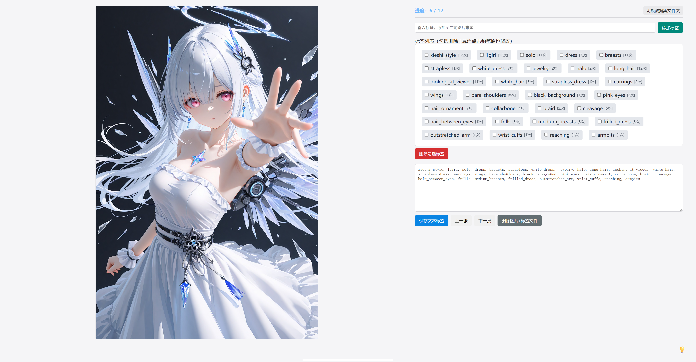

# ImageLabelEditingTool
手动图片标签编辑工具（for Lora-Train）

> 本项目由豆包AI辅助生成

## 📸 图片标签手动编辑工具（Flask + Tkinter）
一款轻量、本地运行、无网络依赖的图片数据集标签手动校对工具，专为 Lora 训练数据集打标、改标签、清洗标签设计。
界面简洁护眼、支持明暗双主题、自带系统文件夹选择、图片居中预览、悬浮方向键切图、标签原位编辑，是本地数据集精加工的完美工具。



## ✨ 核心功能
- ✅ 纯本地运行：所有图片、标签、操作均在本地，不上传、不泄露
- ✅ Tkinter 原生文件夹选择：调用 Windows 系统弹窗，路径选择更标准
- ✅ 明暗双护眼主题
  - 深色模式：深灰护眼（非纯黑）
  - 浅色模式：柔和米白（非纯白）
  - 自动记忆上次主题偏好
- ✅ 图片居中预览 + 左右悬浮方向键
  - 左侧大图区域水平+垂直完全居中
  - 左右悬浮箭头按钮快速切换上一张/下一张
  - 单张图片时自动隐藏方向键
- ✅ 标签原位编辑：鼠标悬浮标签出现铅笔图标，点击直接修改、回车保存、ESC取消
- ✅ 完整标签管理
  - 新增标签
  - 批量勾选删除标签
  - 查看标签出现频次
  - 全文本直接编辑标签内容
- ✅ 文件管理：一键删除当前图片 + 对应 txt 标签文件
- ✅ 记忆上次文件夹路径：重启程序自动加载上次数据集目录
- ✅ 无跳转切换文件夹：弹窗式切换目录，不刷新整页，交互稳定

### 26.08.09 New 🌟
- ✅ 多选标签全图删除
- ✅ 多选标签全图添加

### 26.08.14 New 🌟
- ✅ v2版本：一键离线英翻中标签（需安装torch，transformers）

### 26.08.17 New 🌟
- ✅ 批量替换标签（仅当前图片/全部图片）

## 🖥 界面特色
- 💡 右下角悬浮主题切换灯泡，全局固定，不遮挡操作
- 柔和配色：拒绝纯白纯黑，长时间打标护眼不累眼
- 平滑过渡动画：主题切换、按钮悬浮全部带过渡效果
- 自适应布局：大图预览 + 右侧控制面板黄金比例

## 📁 支持格式
图片格式：.png .jpg .jpeg .webp
标签格式：同目录 .txt 文本标签（逗号分隔标签）

## 🚀 v1版快速启动
1. 安装依赖

⚠️需要python环境

```bash
pip install flask
```

2. 运行程序

```bash
python app.py
```

3. 自动行为
- 程序启动自动打开浏览器页面http://127.0.0.1:7861
- 首次使用选择图片文件夹即可开始打标
- 自动记录上次打开路径与主题模式

## 📌 操作说明
1. 图片切换
- 页面左右悬浮 ← → 方向键快速切图
- 也可使用下方「上一张/下一张」按钮
2. 标签编辑
- 鼠标悬浮标签 → 点击 ✏ 铅笔图标原位修改
- 回车确认修改，ESC 取消
- 支持手动输入新增标签、批量删除勾选标签
3. 切换数据集
- 点击右上角「切换数据集文件夹」
- 弹窗唤起系统文件夹选择窗口，无需刷新页面
4. 主题切换
- 页面右下角 💡 灯泡按钮一键切换深浅色模式

## 📂 项目结构
.  
├── app.py            # 主程序文件  
└── appv2.py          # v2版主程序文件
└── last_path.txt     # 自动生成，记录上次打开的文件夹路径

## 📄 License
开源免费，个人/训练数据集商用均可自由使用、修改。
